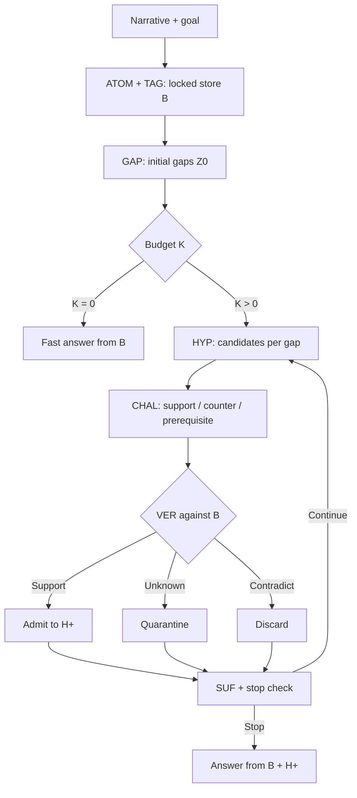

<div align="center">
  

  <br />

  [](https://arxiv.org/abs/2608.29835)
  [](dataset/)
  [](pyproject.toml)
  [](tests/)
  [](LICENSE_CODE_MIT.md)
  [](LICENSE_DATASET_CC_BY_4.0.md)

  **Final-paper reference implementation of evidence-validated hypothesis admission for budget-aware narrative reasoning.**

  [Quick start](#quick-start) · [Algorithm](#paper-aligned-algorithm) · [Evaluation](#paper-evaluation) · [Dataset](#narracrime-300) · [Project page](docs/index.html)
</div>

---

## Why EVAR?

Long narratives encourage a subtle failure: an early, plausible hypothesis enters the reasoning state before it has enough evidence, then later steps reuse it as if it were a fact. EVAR places a hard admission boundary between **candidate generation** and **state update**.

| Verifier label | State transition | Available to final answer? |
|---|---|:---:|
| `Support` | Admit into \(\mathcal H^+\) with source-unit links | Yes |
| `Unknown` | Quarantine for audit | No |
| `Contradict` | Discard with contradicting-unit links | No |

The final answer operator receives only the immutable evidence store \(\mathcal B\) and admitted hypotheses \(\mathcal H^+\). Validation challenges, quarantined candidates, and discarded candidates are deliberately absent from its input.

## Quick start

The offline path uses the same ATOM → TAG → GAP → HYP → CHAL → VER → SUF → ANS control flow as a real model run. It does not use the gold culprit or gold rationale.

```bash
git clone https://github.com/Cosinecos/EVAR.git
cd EVAR

python -m venv .venv
source .venv/bin/activate          # Windows: .venv\Scripts\activate
pip install -e .

python scripts/validate_dataset.py .
python scripts/run_evar.py \
  --config configs/mock.yaml \
  --split Complex \
  --limit 1 \
  --output outputs/demo/evar.jsonl

python -m unittest discover -s tests -v
```

Expected integrity checks:

```text
VALIDATION PASSED
Total cases: 300
Easy: 100 cases
Medium: 100 cases
Complex: 100 cases
...
Ran 11 tests ... OK
```

The mock backend verifies repository integrity only; it is not used for paper results.

## Paper-aligned algorithm



The implementation follows the final equations and Algorithm 1:

- source-linked atomic claims with observable `(entities, time, polarity)` metadata;
- localized `OK / Uncertain / Conflict` tags with severity `0..3`;
- complexity \(\Gamma=\alpha_1|Z_0|+\alpha_2\sum I[status_j\ne OK]+\alpha_3\sum sev_j\);
- budget \(K=\min(B_{max},\max(0,\lceil(\Gamma-\tau_{fast})/\tau_{step}\rceil))\);
- direct HYP generation from each gap — there is **no obsolete Query stage**;
- three hypothesis-conditioned CHAL checks before VER;
- `Z0` is computed once and reused at `t=0`; GAP is recomputed only for `t>0`;
- stopping on no blocking gap, sufficiency threshold, or budget exhaustion;
- complete normalized candidate-ID probability output for NarraCrime.

Every operator output is parsed, contract-validated, and failed closed after configurable JSON-repair attempts. Each run stores an auditable operator trace and the locked-store SHA-256 fingerprint.

## Run a real backbone

Copy the environment template and set an OpenAI-compatible endpoint:

```bash
cp .env.example .env
```

```dotenv
EVAR_API_KEY=...
EVAR_BASE_URL=https://your-provider.example/v1
```

Then run the paper-style DeepSeek-V3.2 configuration:

```bash
python scripts/run_evar.py \
  --config configs/deepseek_v3_2.yaml \
  --split Complex \
  --limit 100 \
  --output outputs/deepseek_v3_2/complex.jsonl
```

The main decoding configuration is `temperature=0`, `top_p=1.0`, and `max_output_tokens=512`. Provider model names and snapshots can change, so every evaluation writes a run manifest and raw predictions.

## Paper evaluation

The evaluator implements the final six NarraCrime measures — no obsolete VA metric remains.

| Metric | Implementation |
|---|---|
| `RVS` | Principal-culprit probability mass + `0.5 ×` accomplice mass; no LLM judge |
| `IR` | Intent proposition recall |
| `ASR` | Action-schema proposition recall |
| `EC` | Supporting-evidence proposition recall |
| `UCR ↓` | Fraction of atomic claims labeled `Unknown` or `Contradict` |
| `CR ↓` | Fraction labeled `Contradict`; therefore `CR ≤ UCR` |

Paper mode uses `sentence-transformers/all-mpnet-base-v2`, cosine threshold `0.8`, descending greedy **one-to-one** matching, and micro-averaging. GPT-5.5 performs predicted-proposition extraction, final-answer atomic decomposition, and evidence-status labeling from fixed prompts. The method identity is not given to the judge, and verdict probabilities are excluded from IR/ASR/EC/UCR/CR.

```bash
pip install -e ".[eval]"

python scripts/evaluate.py \
  --config configs/deepseek_v3_2.yaml \
  --split Complex \
  --limit 100 \
  --methods Direct CoT Self-Refine SC CRITIC S2R-style SELF-DISC. GoT EVAR \
  --output-dir outputs/paper_complex
```

The executable baseline implementations include single-pass prompting, self-refinement, self-consistency (`k=5`), CRITIC, prompt-only S²R-style self-verification, SELF-DISCOVER-style structure selection, and Graph-of-Thought branches.

For the paper's three-run protocol:

```bash
python scripts/run_three_seeds.py \
  --config configs/deepseek_v3_2.yaml \
  --split Complex --limit 100 \
  --methods GoT EVAR \
  --output-dir outputs/three_seed_complex
```

This runs seeds `42`, `44`, and `46`, preserves each resolved configuration, and reports mean plus sample standard deviation.

## NarraCrime-300

The linked repository dataset is included unchanged and loaded directly from disk.

| Split | Cases | Avg. words | Avg. cues | Avg. suspects |
|---|---:|---:|---:|---:|
| Easy | 100 | 863.54 | 8.05 | 3.49 |
| Medium | 100 | 1065.22 | 11.53 | 4.51 |
| Complex | 100 | 1413.40 | 15.93 | 5.95 |
| **Total** | **300** | **1114.05** | **11.84** | **4.65** |

Each case contains `Mystery_text.txt`, `Answer.txt`, `predefined_cues.txt`, and `annotation.json`.

### Construction, briefly

Human authors specified difficulty ranges, evidence-chain requirements, schema constraints, and generation prompts. An AI model first produced a structured fictional case blueprint and then realized it as a long-form narrative without exposing the answer. Automated validation checked structure, references, mappings, split targets, and single-culprit consistency; the protocol also provides independent human-audit sheets. See [construction protocol](docs/construction_protocol.md) and [construction supplement](EVAR_NarraCrime_Construction_Supplement/README.md).

## Repository map

```text
EVAR/
├── assets/                     # GitHub hero artwork
├── configs/                    # mock and paper-style model/evaluator configs
├── dataset/                    # NarraCrime-300
├── docs/                       # project page + reproducibility notes
├── metadata/                   # case index, annotations, recomputed statistics
├── src/narracrime_evar/
│   ├── evar.py                 # final Algorithm 1 control flow
│   ├── models.py               # immutable evidence/state objects
│   ├── contracts.py            # strict operator/output contracts
│   ├── prompts.py              # ATOM/TAG/GAP/HYP/CHAL/VER/SUF/ANS prompts
│   ├── runner.py               # validation, repair, call accounting, traces
│   ├── llm.py                  # mock + OpenAI-compatible backends
│   ├── baselines.py            # executable comparison methods
│   └── metrics.py              # RVS/IR/ASR/EC/UCR/CR
├── scripts/                    # validation, inference, evaluation entry points
└── tests/                      # offline control-flow and metric tests
```

Implementation choices not numerically fixed in the paper — routing coefficients and thresholds, operator fan-out caps, batching, and malformed-output policy — are exposed in YAML and documented in [reproducibility notes](docs/reproducibility.md), rather than hidden in code.

The release's completed offline checks are recorded in the [validation report](docs/validation_report.md).

## Citation

```bibtex
@article{liu2026evar,
  title   = {EVAR: Evidence-Validated Hypothesis Admission for Budget-Aware Narrative Reasoning},
  author  = {Liu, Peilin and Ji, Zhiquan and Ping, Jinglong},
  journal = {arXiv preprint arXiv:2608.29835},
  year    = {2026}
}
```

Code is released under the [MIT License](LICENSE_CODE_MIT.md); the dataset is released under [CC BY 4.0](LICENSE_DATASET_CC_BY_4.0.md).
