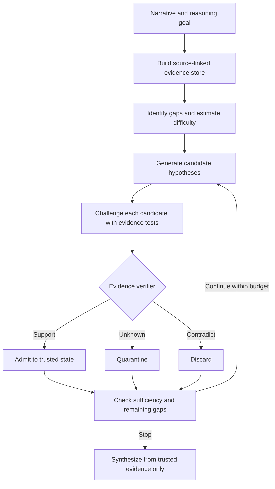

<div align="center">
  

  <br />

  [](https://arxiv.org/abs/2608.29835)
  [](dataset/)
  [](LICENSE_DATASET_CC_BY_4.0.md)

  **Evidence-Validated Hypothesis Admission for budget-aware narrative reasoning.**

  [Overview](#overview) · [Method](#method-overview) · [Dataset](#narracrime-300) · [Evaluation](#evaluation) · [Citation](#citation)
</div>

---

## Overview

Long-form narrative reasoning requires a model to connect evidence distributed across many paragraphs, distinguish facts from interpretations, and revise intermediate conclusions when new information becomes relevant. A common failure occurs when an early but plausible hypothesis is accepted before it has sufficient support. Once that hypothesis enters the reasoning context, later steps may repeatedly reuse it as though it were an established fact, producing a coherent but weakly grounded conclusion.

EVAR addresses this problem by separating **hypothesis generation** from **hypothesis admission**. The model may freely propose explanations, but a proposal cannot become part of the trusted reasoning state until it has been checked against the source narrative. This creates an explicit boundary between what the model is considering and what the available evidence supports.

EVAR also uses a complexity-aware reasoning budget. Relatively direct cases can proceed to an answer with limited refinement, while cases containing unresolved gaps, conflicts, or difficult evidence chains receive additional rounds of hypothesis generation and verification.

## Method overview

EVAR organizes narrative reasoning around two main states:

- an immutable evidence store, denoted by \(\mathcal B\), containing source-linked claims extracted from the narrative;
- an admitted hypothesis set, denoted by \(\mathcal H^+\), containing only hypotheses that have passed evidence validation.

Candidate, quarantined, and contradicted hypotheses are kept outside the state used to produce the final answer.



### 1. Source-linked evidence store

The narrative is first decomposed into smaller evidence units. Each unit preserves a link to its source span and records observable information such as the involved entities, temporal relations, and polarity. Local consistency analysis marks whether a unit is clear, uncertain, or potentially conflicting.

This store is treated as the evidential authority throughout reasoning. Later hypotheses do not rewrite the source evidence. Keeping the evidence store fixed helps prevent a model-generated interpretation from silently becoming a new fact.

### 2. Gap analysis and budget routing

EVAR identifies information gaps that prevent a reliable answer. Examples include an unresolved timeline, missing access conditions, an unexplained physical trace, or competing explanations for the same event.

The number and severity of these gaps are combined into an instance-level complexity estimate. This estimate determines a bounded refinement budget. The purpose is to allocate verification effort according to the case rather than applying the same number of reasoning steps to every narrative.

### 3. Candidate hypothesis generation

For each unresolved gap, the model proposes one or more candidate explanations. At this stage, a candidate is only a possibility. It is not yet available to the final answer and does not enter the trusted reasoning state.

This distinction allows the system to explore alternatives without treating all generated content as equally reliable.

### 4. Hypothesis-conditioned challenges

Each candidate is converted into explicit evidence checks. EVAR considers three complementary questions:

1. What evidence directly supports the hypothesis?
2. What evidence contradicts it or supports an alternative?
3. Which indispensable prerequisite must be true for the hypothesis to hold?

The challenge stage specifies what should be tested. A challenge is not itself evidence and cannot authorize a state update.

### 5. Evidence-validated admission

The verifier compares each candidate with the locked evidence store and assigns one of three labels:

| Verifier label | State transition | Available to the final answer? |
|---|---|:---:|
| `Support` | Admit into \(\mathcal H^+\) with supporting source links | Yes |
| `Unknown` | Quarantine because the available evidence is insufficient | No |
| `Contradict` | Discard and record the conflicting evidence | No |

Only `Support` produces an admission. `Unknown` is not treated as weak support, and a plausible hypothesis cannot enter the trusted state merely because no contradiction was found.

### 6. Iterative refinement and stopping

After a verification round, EVAR reassesses the remaining reasoning gaps and the sufficiency of the admitted evidence. It continues while material gaps remain and the allocated budget permits another round.

Reasoning stops when the evidence is sufficient, no blocking gap remains, or the budget is exhausted. This stopping rule balances answer quality with inference cost and prevents unconstrained self-refinement.

### 7. Constrained final synthesis

The final answer is generated only from \(\mathcal B\) and \(\mathcal H^+\). Quarantined hypotheses, contradicted candidates, and the model's internal challenges are excluded from the final synthesis context.

This boundary is the central design principle of EVAR: generation proposes possible explanations, verification controls state admission, and the final answer is restricted to evidence that remains traceable to the narrative.

## NarraCrime-300

NarraCrime-300 is a synthetic benchmark for evidence-grounded reasoning over fixed, non-interactive detective narratives. It contains 300 cases divided equally across three difficulty levels.

| Split | Cases | Average words | Average evidence cues | Average suspects |
|---|---:|---:|---:|---:|
| Easy | 100 | 863.54 | 8.05 | 3.49 |
| Medium | 100 | 1065.22 | 11.53 | 4.51 |
| Complex | 100 | 1413.40 | 15.93 | 5.95 |
| **Total** | **300** | **1114.05** | **11.84** | **4.65** |

Each case contains:

- `Mystery_text.txt`: the narrative presented to the model;
- `Answer.txt`: the reference verdict and explanation;
- `predefined_cues.txt`: the supporting evidence cues;
- `annotation.json`: structured labels for the culprit, intent, action schema, evidence, distractors, and construction blueprint.

Difficulty is controlled through factors such as story length, suspect count, evidence-chain length, distractor count, and the amount of cross-event or implicit-premise reasoning required to reach the conclusion.

## Dataset construction

NarraCrime was produced through a structured, AI-assisted construction process. The protocol defines the task format, difficulty ranges, annotation dimensions, evidence-chain requirements, and generation constraints. A language model was used to produce fictional case blueprints and convert them into narrative form.

The construction workflow includes:

1. selecting a difficulty profile and case setting;
2. defining the culprit, intent, opportunity, and action sequence;
3. designing a solvable chain of supporting evidence;
4. adding plausible distractors that do not invalidate the intended solution;
5. realizing the blueprint as a self-contained narrative;
6. producing structured annotations and reference answers;
7. checking file completeness, schema consistency, candidate references, evidence counts, and difficulty targets.

The construction supplement includes reference prompts, schemas, examples, and review utilities. These materials explain the construction approach. They do not provide deterministic regeneration of the released cases, and blank review templates should not be interpreted as proof that every case has undergone an independently recorded human audit.

See the [construction protocol](docs/construction_protocol.md), [datasheet](docs/datasheet.md), [quality-control notes](docs/quality_control.md), and [construction supplement](EVAR_NarraCrime_Construction_Supplement/README.md).

## Relationship to SABA

NarraCrime follows the broad non-interactive detective-reasoning setting explored in [SABA](https://arxiv.org/abs/2604.20413), but it is designed for a different purpose and extends the setting substantially.

SABA primarily investigates whether a model can recognize potential reasoning failures before committing to an action, with detective-style narratives serving as one evaluation setting. NarraCrime, by contrast, is constructed as a dedicated benchmark for **evidence-grounded long-form reasoning**. It contains 300 synthetic cases organized into three controlled difficulty levels and provides structured annotations for culprit roles, intent, action schemas, supporting evidence, distractors, and construction blueprints.

The evaluation design also differs in emphasis. NarraCrime and EVAR do not only ask whether a model reaches the correct suspect or recovers the expected reasoning content; they additionally examine how the final conclusion is supported by the narrative evidence. Role-Aware Verdict Score (`RVS`) evaluates the model's probability distribution over candidate roles, while Intent Recall (`IR`), Action Schema Recall (`ASR`), and Evidence Coverage (`EC`) operate on structured proposition-level annotations. Unsupported Claim Rate (`UCR`) and Contradiction Rate (`CR`) further measure whether claims in the final answer are unsupported by, or inconsistent with, the source narrative.

NarraCrime therefore shares the general detective-reasoning setting with SABA while differing in **dataset scale, controlled difficulty design, annotation granularity, explicit distractor modeling, verdict formulation, and direct evaluation of evidence-grounding reliability**. The benchmark is intended to support a more fine-grained analysis of long-form reasoning under evidence constraints rather than simply reproduce the earlier task formulation.

## Evaluation

The evaluation covers the correctness of the verdict, recovery of reference content, evidence grounding, and unsupported or contradictory claims.

| Metric | Purpose |
|---|---|
| `RVS` | Measures probability mass assigned to the principal culprit and gives partial weight to annotated accomplices |
| `IR` | Measures recovery of annotated intent propositions |
| `ASR` | Measures recovery of annotated action-schema propositions |
| `EC` | Measures coverage of annotated supporting evidence |
| `UCR ↓` | Measures the proportion of final-answer claims that are unsupported or contradicted |
| `CR ↓` | Measures the proportion of final-answer claims that directly contradict the evidence |

IR, ASR, and EC compare predicted propositions with the corresponding reference propositions. RVS evaluates the model's distribution over candidate roles. UCR and CR examine the evidential status of atomic claims in the final response. Together, these measures distinguish arriving at the correct verdict from providing a complete and evidence-supported explanation.

## Repository contents

```text
EVAR/
├── dataset/                                  # NarraCrime-300 cases
├── metadata/                                 # index, annotations, and statistics
├── EVAR_NarraCrime_Construction_Supplement/  # construction and review materials
├── docs/                                     # dataset and project documentation
├── paper_assets/                             # dataset description and statistics table
├── quality_control/                          # manual-review template
├── assets/                                   # repository artwork
└── CITATION.cff
```

## Citation

```bibtex
@article{liu2026evar,
  title   = {EVAR: Evidence-Validated Hypothesis Admission for Budget-Aware Narrative Reasoning},
  author  = {Liu, Peilin and Ji, Zhiquan and Ping, Jinglong},
  journal = {arXiv preprint arXiv:2608.29835},
  year    = {2026}
}
```

The relationship described above refers to:

```bibtex
@article{fan2026saba,
  title   = {Self-Awareness before Action: Mitigating Logical Inertia via Proactive Cognitive Awareness},
  author  = {Fan, Fulong and Liu, Peilin and Liu, Fengzhe and Yang, Shuyan and Yan, Gang},
  journal = {arXiv preprint arXiv:2604.20413},
  year    = {2026}
}
```

## License

NarraCrime-300 and its dataset-specific metadata are released under [CC BY 4.0](LICENSE_DATASET_CC_BY_4.0.md). See [LICENSE](LICENSE) for licensing information covering the remaining repository materials.

> **Coming soon:** The complete EVAR implementation and detailed reproduction instructions are currently being organized and will be released in this repository.
